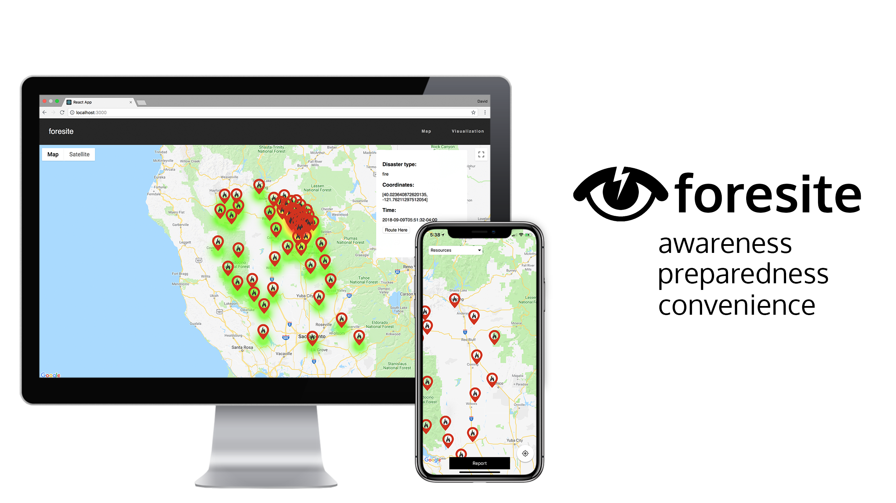

# foresite 

App built with Swift, as a crowd sourcing and data driven solution to natural diasters.

# Inspiration
During the information session presented by the Wharton Risk Center, we were inspired by the story of a little girl who recognized the early signs of a tsunami but found difficulty in spreading awareness. After finally contacting the right person, they managed to get everyone off the beach and it became the only place where no one died to the tsunami. Other problems found were a lack of data involving the extent of flooded areas and other natural disasters, and difficulties in safely delivering supplies to sites in areas affected by diasters. We wanted to build a solution that gives users the power to alert others to disasters who are within close proximity, collects missing data in a non-intrusive manner, and provides critical support and directions during disasters.

# What it does
##Mobile Application
We connect our users. 
Our iOS mobile app gives users the power to report a disaster in their area, whether it's flooding, fire, earthquake, tsunami, etc. Other users of the application within a certain radius is notified of a potential threat. They can quickly and conveniently respond yes or no with two clicks of the notification. Whether they answer yes, no, or no response, the data is stored and mapped on our web application. After sending a report, the application offers tips and resources for staying safe, and the user can prepare accordingly for the disaster.

##Web Application 
https://github.com/gkim98/foresite-web
###Data Visualization
Our web application makes it extremely to visualize the extent of an incident. If someone responds yes, they are plotted with a red heatmap. If someone responds no, they are plotted with a blue heatmap. As a result, the affected area should be plotted with red by users who were affected, and should be bounded by a blue where users reported they didn't see anything. This data can be analyzed and visualized even more in the visualization page of our web a pp

###Mission Control
Delivering supplies to sites can be dangerous, so first responders need a safe and efficient way to quickly deliver supplies. Safe routes are provided such that in order to get from point A to point B, only non affected routes will be taken. For example, if the shortest path to get from point A to point B is to go through a road that was reported to be flooded by the users, the route would avoid this road entirely.
